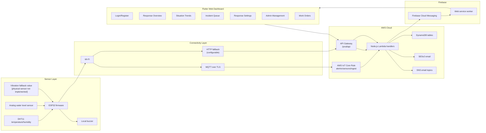
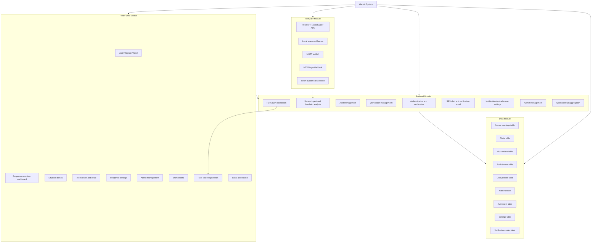
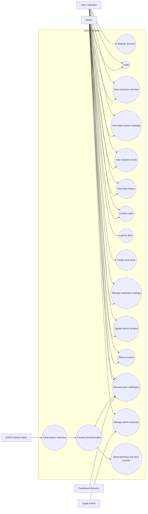
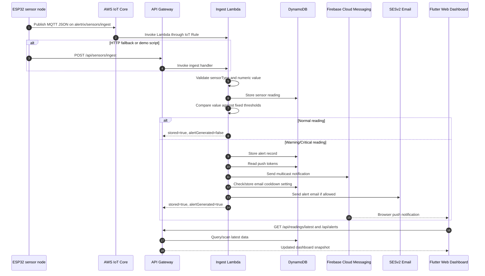
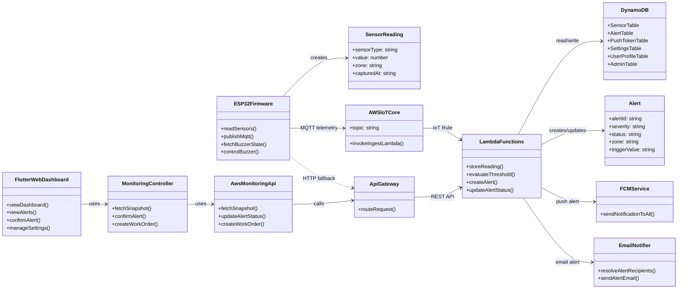
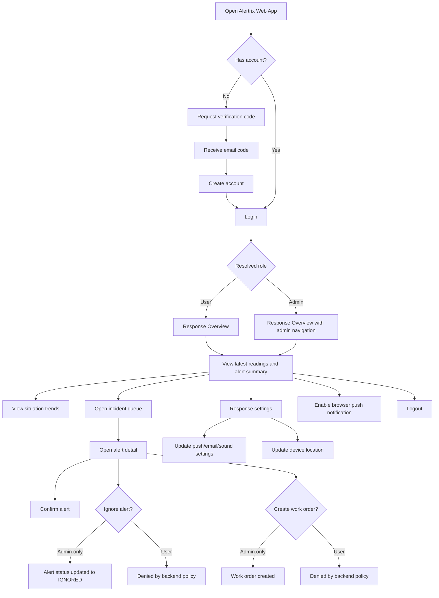

# Alertrix Diagrams

The diagrams below are generated from the implemented repository structure. Items marked `[Not implemented]` or `[To be completed]` should not be described as completed in the final report until evidence is added.

## System Architecture Diagram



## Module Diagram



## Use Case Diagram



## Alert Processing Sequence Diagram



## Database Design Diagram

```mermaid
erDiagram
    SENSOR_READINGS {
        string sensorType PK
        string capturedAt SK
        number value
        string zone
    }

    ALERTS {
        string alertId PK
        string title
        string severity
        string status
        string detectedAt
        string zone
        string triggerValue
        string workOrderId
    }

    WORK_ORDERS {
        string workOrderId PK
        string alertId FK
        string status
        string assignee
        string note
        string createdAt
    }

    PUSH_TOKENS {
        string token PK
        string userId
        string platform
        string updatedAt
    }

    SETTINGS {
        string settingId PK
        string location
        string zone
        string silencedUntil
        string lastSentAt
    }

    USER_PROFILES {
        string userId PK
        string role
        string pushRule
        boolean alertSoundEnabled
        string notificationEmail
    }

    ADMINS {
        string adminId PK
        string name
        string email
        string role
        string status
    }

    AUTH_USERS {
        string username PK
        string name
        string passwordHash
        string email
        string role
    }

    VERIFICATION_CODES {
        string email PK
        string code
        string name
        number expiresAtMs
        number ttl
    }

    ALERTS ||--o| WORK_ORDERS : "alertId"
    AUTH_USERS ||--o| USER_PROFILES : "username/userId"
    USER_PROFILES ||--o{ PUSH_TOKENS : "userId"
```

## Class Diagram



## User Flow Diagram



## Report Figure Notes

The diagrams are Mermaid drafts. For the final submitted report, export them as high-resolution images and add captions such as:

| Figure | Suggested caption |
|---|---|
| System architecture | Overall Alertrix cloud-assisted IoT architecture. |
| Module diagram | Main implementation modules of the Alertrix prototype. |
| Use case diagram | Main actors and use cases supported by the Alertrix prototype. |
| Sequence diagram | Alert processing sequence from sensor telemetry to dashboard notification. |
| Database design | DynamoDB table structure and application-level relationships. |
| Class diagram | Main firmware, backend, and Flutter Web classes/components in Alertrix. |
| User flow | User interaction flow for authentication, monitoring, alert response, and settings. |
